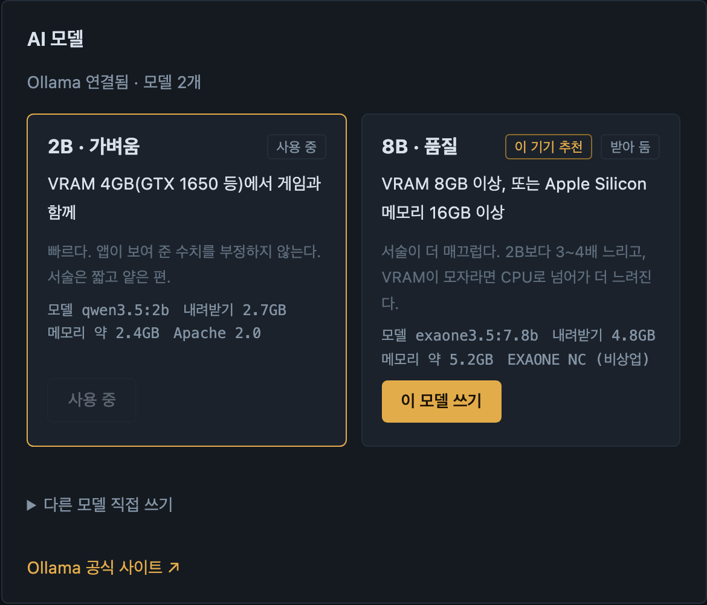

# 메피티 (MAGPT)

메이플스토리 캐릭터를 불러와 장비를 게임 장비창처럼 보여 주고, 스타포스 기대값 같은 계산을 **대화로** 해 주는 앱입니다.
전부 **내 컴퓨터 안에서** 돌아갑니다. 모르는 건 지어내지 않고 "모른다"고 답합니다.

<p align="center">
  <a href="https://github.com/limchanggeon/MAGPT/releases/latest/download/Mepiti-Windows-Setup.exe"><b>⬇ Windows 설치 파일 (.exe)</b></a>
  &nbsp;·&nbsp;
  <a href="https://github.com/limchanggeon/MAGPT/releases/latest/download/Mepiti-macOS.dmg"><b>⬇ Mac 설치 파일 (.dmg)</b></a>
  &nbsp;·&nbsp;
  <a href="https://github.com/limchanggeon/MAGPT/releases/latest">모든 버전</a>
</p>


## 이런 걸 합니다

| | |
|---|---|
| **캐릭터·장비** | 넥슨 공식 Open API로 캐릭터를 불러와 장비를 게임 장비창과 같은 자리에 보여 줍니다. 칸마다 스타포스, 주문서 횟수, 추가옵션 급(`183`, 무기는 `1추`)이 붙습니다. |
| **스타포스 기대값** | "모자 21성까지 기대값 얼마야?"처럼 물으면 기대 비용·시도·파괴 횟수를 계산합니다. 이벤트(샤타포스 등)·파괴방지·할인 조건은 버튼으로 한 번만 고르면 기억합니다. |
| **AI 설명** | 계산 결과 숫자는 앱이 직접 쓰고, AI는 설명만 덧붙입니다. AI가 없는 숫자를 지어내면 그 문장은 버립니다. |
| **수익·기록** | 재획·주간 보스 수익을 적어 두고, 스타포스 강화 기록을 기대값과 비교합니다. |


---

## 설치 방법

GitHub 계정이나 개발 지식은 필요 없습니다.

### Windows

1. 위의 **Windows 설치 파일**을 받아 더블클릭합니다.
2. 파란 창에 "Windows의 PC 보호"가 뜨면 **추가 정보** → **실행**을 누릅니다. (개인이 만든 앱이라 인증서가 없어서 뜨는 경고입니다.)
3. 설치 마법사에서 **AI 모델**을 고릅니다. 컴퓨터의 그래픽카드를 보고 알맞은 쪽이 미리 골라져 있습니다.
   - **2B · 가벼움** — GTX 1650처럼 그래픽 메모리 4GB인 컴퓨터에서 게임과 함께 쓰기 좋습니다.
   - **8B · 품질** — 그래픽 메모리 8GB 이상인 컴퓨터용. 설명이 더 매끄럽지만 3~4배 느립니다.
   - 잘 모르겠으면 미리 골라진 그대로 두세요. 나중에 앱 설정에서 바꿀 수 있습니다.
4. AI를 돌리는 무료 프로그램 **Ollama**가 없으면 함께 설치합니다(약 1.5GB를 내려받습니다).
5. 설치가 끝나고 메피티를 처음 켜면, 고른 AI 모델(2.7~4.8GB)을 내려받습니다. 진행률이 화면에 보이고, 끝나면 바로 쓸 수 있습니다.

### Mac (M1·M2·M3·M4)

1. 위의 **Mac 설치 파일**을 받아 더블클릭하고, 열린 창의 **Mepiti**를 **응용 프로그램(Applications)** 폴더로 끌어다 놓습니다.
2. 응용 프로그램 폴더에서 **Mepiti**를 실행합니다. "확인되지 않은 개발자" 경고가 뜨면
   **시스템 설정 → 개인정보 보호 및 보안** 아래쪽의 **그래도 열기**를 누릅니다. 처음 한 번만 하면 됩니다.
3. 처음 켜면 아래 화면이 나옵니다. Ollama가 없으면 **Ollama 설치** 버튼 하나로 설치되고(약 190MB, 관리자 암호 불필요), 이어서 AI 모델을 고르면 됩니다.


인텔 칩 Mac(2020년 이전 모델)용 파일은 아직 없습니다.

실행하면 브라우저에 메피티 화면이 열립니다. 주소는 `http://127.0.0.1:8765`이며 **내 컴퓨터 안에서만** 열립니다.

### 넥슨 API 키 넣기 (캐릭터를 불러오려면 필요)

1. [넥슨 Open API](https://openapi.nexon.com/ko/)에 넥슨 계정으로 로그인합니다.
2. 상단 **애플리케이션** → **애플리케이션 등록**에서 메이플스토리를 고르고 아무 이름으로 등록합니다. 서비스 단계는 **개발 단계**를 고르면 바로 발급됩니다.
3. 발급된 **API Key**(`test_`로 시작하는 긴 글자)를 복사합니다.
4. 메피티 왼쪽 아래 **설정** → **넥슨 API 키**에 붙여 넣고 저장합니다.
5. **캐릭터** 화면에서 내 계정의 캐릭터를 골라 등록합니다.

키는 컴퓨터의 보안 저장소(Windows 자격 증명 관리자, Mac 키체인)에만 저장되고 다른 곳으로 보내지 않습니다.
Mac에서 "키체인 접근 허용" 창이 뜨면 **허용**을 누르세요.

## AI 모델 고르기

AI 모델은 설정에서 언제든 바꿀 수 있습니다. 둘 다 내려받아 두고 번갈아 써도 됩니다.



| | 2B · 가벼움 | 8B · 품질 |
|---|---|---|
| 모델 | `qwen3.5:2b` | `exaone3.5:7.8b` |
| 내려받기 / 쓰는 메모리 | 2.7GB / 약 2.4GB | 4.8GB / 약 5.2GB |
| 답 하나 걸리는 시간(측정 기기 기준) | 약 3초 | 약 12초 |
| 알맞은 컴퓨터 | 그래픽 메모리 4GB(GTX 1650 등), 게임과 함께 | 그래픽 메모리 8GB 이상, Apple Silicon 메모리 16GB 이상 |
| 라이선스 | Apache 2.0 | EXAONE NC (비상업) |

**둘의 차이는 생각보다 작습니다.** 이 앱에서는 스타포스 기대값 같은 숫자를 AI가 아니라 앱이 계산하고, AI는 설명만 덧붙이기 때문입니다.
8B는 설명이 더 매끄럽고, 2B는 훨씬 빠르고 가볍습니다. 그래픽 메모리가 부족한 컴퓨터에서 8B를 쓰면 게임과 메모리를 나눠 쓰느라 둘 다 느려질 수 있습니다.
(측정: 2026-09-28, Apple M4 / 16GB. GTX 1650 실측은 아직 없습니다. 자세한 비교는 [HANDOFF.md](HANDOFF.md) '가벼운 모델 찾기'.)

AI 없이도 캐릭터 조회·장비 보기·스타포스 계산은 다 됩니다.

## 쓰는 법

- **질의** 화면에서 말로 물어보면 됩니다. 예: `모자 21성까지 기대값 얼마야?`, `샤타포스일때는`, `파괴방지도 쓸래`
- **내 장비로 대화**: 입력창 옆 **장비** 버튼으로 장비를 고르면 그 장비를 주제로 한 대화가 열립니다. `21성은?`처럼 부위를 말하지 않아도 알아듣습니다.
- **장비 프리셋**: 캐릭터 화면에서 `프리셋 1 · 2 · 3`을 눌러 각 프리셋 장비를 볼 수 있습니다.
- **기록** 탭: 스타포스 강화 기록을 불러와 장비마다 쓴 돈과 기대값을 비교합니다.
- **수익** 탭: 재획·주간 보스 수익을 기록합니다. 이번 주 주보는 스케줄러에서 불러올 수 있습니다.
- **공지·이벤트**: `지금 진행 중인 이벤트 뭐 있어?`처럼 물으면 넥슨 공식 목록과 링크로 답합니다.
- 장비 값(노작값)이 필요하면 물어봅니다. `32억`, `2천만`처럼 적으면 됩니다.
- 조건을 바꾸려면 `강화 조건 다시`라고 적으세요. 끌 때는 **설정** → **로컬 앱 종료**.

## 문제가 생기면

| 증상 | 해결 |
|---|---|
| 브라우저 화면이 안 열림 | 브라우저 주소창에 `http://127.0.0.1:8765`를 직접 입력하세요. |
| "앱 연결 실패" 알림 | 메피티가 꺼져 있습니다. 앱을 다시 실행한 뒤 새로고침하세요. |
| "Ollama가 실행 중이 아닙니다" | Ollama 앱을 실행한 뒤 **다시 확인**을 누르세요. Windows는 시작 메뉴, Mac은 응용 프로그램 폴더에 있습니다. |
| AI 모델 내려받기가 멈춤 | 인터넷 연결과 남은 저장 공간을 확인하고 설정의 AI 모델에서 다시 누르세요. |
| 캐릭터 목록이 안 나옴 | API 키를 확인하세요. 발급 직후에는 몇 분 걸릴 수 있습니다. |
| 다운로드 링크가 404 | 새 버전 파일이 아직 올라가는 중일 수 있습니다. 몇 분 뒤 [모든 버전](https://github.com/limchanggeon/MAGPT/releases) 페이지에서 받으세요. |

## 알아 두실 점

- 스타포스 확률표·비용식은 오픈소스 계산기 [mesulive](https://github.com/kurateh/mesulive)의 값을 옮긴 것이며 **넥슨 공식 발표와 대조한 값이 아닙니다.**
- 추가옵션 급(`183`, `1추`)은 커뮤니티 약식 기준입니다. 게임이 주는 등급이 아닙니다.
- 시험판(알파)이라 오류가 있을 수 있습니다. 이상한 답을 보면 화면을 캡처해서 알려 주세요.

---

# 개발자용 안내

아래는 소스 코드에서 직접 실행하거나 설치 파일을 만드는 분을 위한 내용입니다.

로컬 웹 UI와 Python 서버, SQLite 저장소, Ollama 연결, 넥슨 API 어댑터를 포함합니다. **전 분야 상담을 완성한 제품은 아닙니다.** 검토된 지식 자료가 없으면 보류하며, 모델의 미검증 생성 문장을 게임 사실로 출력하지 않습니다.

## 소스에서 실행

Python 3.12를 권장합니다. 서버·계산·검색은 Python 표준 라이브러리로 실행되며, API 키 보관·이미지는 의존 패키지가 필요합니다.

```sh
python3 -m venv .venv
.venv/bin/python -m pip install -e .
.venv/bin/python -m mepiti
```

Windows PowerShell:

```powershell
py -3.12 -m venv .venv
.venv\Scripts\python.exe -m pip install -e .
.venv\Scripts\python.exe -m mepiti
```

설치 후 macOS는 `run.command`, Windows는 `run.bat`로 실행할 수 있습니다. 브라우저가 `http://127.0.0.1:8765`로 열립니다. 설정의 **로컬 앱 종료** 또는 터미널에서 Ctrl+C로 종료합니다. 이미 실행 중이면 같은 주소로 접속하세요. 포트 변경은 `--port 8766`, 브라우저를 열지 않으려면 `--no-browser`를 사용합니다.

데이터는 `~/.mepiti/mepiti.sqlite3`에 저장됩니다. 별도 테스트 저장소는 `--data-dir 경로`로 지정합니다. API 키는 macOS Keychain / Windows Credential Manager / Linux Secret Service만 허용하며 평문 저장으로 대체하지 않습니다. 시스템 키체인 접근 창이 나타날 수 있습니다.

## 첫 사용

1. **연결 및 설정:** [Ollama](https://ollama.com/download)를 실행합니다. 설정의 AI 모델에서 2B(`qwen3.5:2b`)·8B(`exaone3.5:7.8b`) 중 하나를 고르면 받은 뒤 사용 모델로 정합니다(`mepiti/models.py`). 앱이 기본 모델을 정하지 않으며, 사용자가 고르기 전에는 대용량 다운로드를 하지 않습니다. Windows 설치 마법사의 선택은 `~/.mepiti/setup.json`으로 넘어와 첫 실행에서 한 번 쓰입니다. 모델이 없어도 검색·계산·캐릭터 관리는 사용할 수 있습니다.
2. **넥슨 API 키:** 본인의 키를 보안 저장소에 등록합니다. 키 저장 후 내 캐릭터 화면으로 이동해 실제 계정 목록을 조회합니다. 실패하면 목록 영역에 오류 원인을 표시합니다. Analytics 스크립트와 app_id는 인증 키가 아니며 캐릭터 조회에 사용하지 않습니다.
3. **내 캐릭터:** 저장된 키로 계정 캐릭터 목록을 자동 조회합니다. 이름·월드·직업으로 검색하고 `등록 · 정보 조회`를 누르면 관리 목록에 등록하고 기본 정보·전투력·외형을 불러옵니다. 직접 이름을 입력해 저장해도 상세 조회를 이어서 진행합니다. 여러 캐릭터, 대표 캐릭터, 목표, 예산을 저장하고 최근 두 스냅샷을 비교합니다. 데이터 조회 시점과 API 기준일을 구분합니다. API 스냅샷은 30일 후 제거됩니다.
4. **착용 장비:** 게임 장비창과 같은 5열 6행 자리에 장비를 표시합니다. 칭호와 안드로이드도 각자 자리에 표시합니다. 칸 왼쪽 위는 `★스타포스 +주문서 강화 횟수`, 왼쪽 아래는 추가옵션 환산값입니다. 추가옵션이 있는 칸과 없는 칸은 색으로 구분하고, 비어 있는 자리는 슬롯 이름만 흐리게 남깁니다. 칸을 누르면 옵션·잠재능력·추가옵션 상세를 확인합니다. 추가옵션 환산값은 `주스탯 + 올스탯 1%당 10`으로 계산한 **표시용 관례이며 게임 공식이 아닙니다**. 주스탯은 캐릭터 최종 능력치 중 최댓값으로 판단하고, 무기·보조무기·엠블렘은 공격력(법사 계열은 마력)을 기준으로 씁니다.
5. **지식 자료실:** 본문·URL·발행/수정일·적용 기간·버전·지역/서버·주제·재검토 기한을 등록하고 원문을 확인한 뒤 승인합니다. 현재 유효한 KR/live 자료만 검색하며 동일 주제에 다른 활성 버전이 있으면 보류합니다. 날짜 종료 경계는 KST 0시입니다.
6. **채팅:** 자료 검색 답변은 근거 원문을 발췌하고 없으면 보류합니다. 이때 모델은 근거 문장 ID만 고릅니다(JSON 스키마로 강제). 캐릭터 분석에서는 조회한 캐릭터 사실만 넘겨 모델이 서술하되, 계산 수치는 앱이 직접 쓰고, 사실에 없는 금액·퍼센트·확률이 섞인 서술은 버립니다. 생각(thinking) 모드가 있는 모델은 끄고 부릅니다.
7. **이미지:** `＋`로 PNG/JPEG/WebP를 첨부합니다. Tesseract의 `kor`·`eng` 언어팩이 필요합니다. 인식한 내용을 직접 수정·확인한 다음 질문에 사용합니다. 이미지는 임시 디렉터리에서 처리 후 삭제하고, 확인한 텍스트는 대화에 보관합니다.

모델 연결, 검색, 외부 API 오류를 구분해서 표시합니다. 인터넷 없이도 저장된 자료 검색은 가능하지만 사이트의 최신 상태라고 단정하지 않습니다.

## 계산 범위

- **수익** 탭: 재획 기록(번 메소 + 솔 에르다 조각 개수 × 조각 가격 = 이번 재획 총수익, 재획비 1개당 수익)과
  주보 기록(결정석 판매가 ÷ 파티 인원 + 추가 드롭 수익 = 내 몫)을 남기고, 이번 주(목요일 초기화 기준)·이번 달·전체 합계를 봅니다.
  금액은 `12억 3500만`, `650만`, `2천만`처럼 적으면 됩니다. 조각 시세는 사용자가 적은 값만 씁니다.
  **이번 주 주보 불러오기**: 관리 중인 캐릭터의 스케줄러(넥슨 Open API)에서 이번 주에 잡은 보스를 가져옵니다.
  결정석 가격은 공식 공지(업데이트 813 보스 리워드 개편)의 판매가로 채우고, 파티 인원만 고르면 됩니다.
  직접 기록할 때는 보스 이름별 줄에서 잡은 난이도를 **체크**하고 파티 인원을 고른 뒤 한 번에 저장합니다(한 보스는 한 난이도만).
  검은 마법사는 2026-10-01부터 변경 가격을 씁니다. 같은 주·캐릭터·보스는 두 번 저장되지 않습니다.
- 잠재능력(큐브) 확률은 다루지 않습니다.
- 스타포스 기대값: 장비 레벨·현재 성·목표 성·스페어 값으로 기대 비용/시도/파괴 횟수를 계산합니다.
  확률표와 비용식은 오픈소스 계산기 [mesulive](https://github.com/kurateh/mesulive)에서 가져왔으며
  **넥슨 공시와 대조한 값이 아닙니다.** 확률표에는 스타캐치(x1.05)가 반영되어 있습니다.
  파괴 시 스페어 장비가 반드시 들므로 노작값을 모르면 계산하지 않고 되묻습니다.
  이벤트(1+1·30% 할인·5/10/15성 100%·파괴 30% 감소·샤타포스), MVP/PC방 할인, 파괴방지, 흔적 복구를 반영합니다.
  파괴방지는 게임과 같이 15~17성 시도에만 적용되며, 할인 없는 기본 비용의 2배를 시도마다 추가로 냅니다.
  18성 이상에서 파괴방지를 켜 두면 계산에 반영하지 않고 그 사실을 결과에 알립니다.
  할인은 시도 비용에만 적용되고 스페어 장비 값에는 붙지 않습니다. MVP·PC방 할인은 16성 이하 시도에만 붙고,
  이벤트 30% 할인은 그 위에 곱해 적용합니다(mesulive와 같음). 흔적 복구를 쓰는 조건이면 복구 없이 계산한 값도 함께 보여 줍니다.
  채팅에서는 강화 조건을 한 번 묻고 저장한 뒤 그 조건으로 계산합니다. "강화 조건 다시"로 바꿀 수 있습니다.

## 자료 가져오기

요구사항에 기재된 두 수집 ZIP은 작업 폴더에 없었습니다. 검증되지 않은 샘플 게임 지식을 기본 DB에 넣지 않았습니다. UI에서 등록하거나, 다음 JSONL 스키마로 변환해 가져올 수 있습니다.

```json
{"title":"자료 제목","body":"검토할 원문","metadata":{"source_url":"https://maplestory.nexon.com/실제-출처","source_type":"official","published_at":null,"modified_at":null,"effective_from":"실제 적용일 YYYY-MM-DD","effective_to":null,"version":"검토한 실제 버전","region":"KR","server_type":"live","valid_until":"재검토 기한 YYYY-MM-DD","topic":"동일 규칙을 묶는 주제 ID"}}
```

```sh
.venv/bin/python scripts/import_documents.py sources.jsonl
```

가져온 자료는 항상 검토 대기 상태입니다. 수집 시각·본문 SHA-256은 생성되며 수집 시각을 적용일로 대체하지 않습니다. 자동 웹 수집, HTML 정제, OCR 표 추출, 자료 업데이트 스케줄러는 후속 작업입니다. 현재 자료는 승인 후에도 원문 사이트를 자동 재확인하지 않으므로 재검토 기한을 짧게 설정해야 합니다.

## 검증 및 모델 실험

```sh
.venv/bin/python -m unittest discover -s tests -v
node --check mepiti/static/app.js
.venv/bin/python scripts/benchmark.py 설치된모델1 설치된모델2
.venv/bin/python scripts/eval_models.py qwen3.5:2b exaone3.5:7.8b   # 이 앱의 실제 과제로 모델 비교
.venv/bin/python scripts/demo_server.py --port 8790                  # README 스크린샷용 데모 서버(가짜 넥슨 응답)
```

`eval_models.py`는 숫자 없이 덧붙이기·약한 부위 분석·지어내기 유혹·근거 선택 네 과제를 앱의 실제 검증 함수로 채점합니다. 캐릭터 사실은 대표 캐릭터를 한 번 조회해 이름을 익명화한 뒤 `artifacts/`(git 제외)에 두며 DB에는 쓰지 않습니다. `benchmark.py`는 같은 합성 질문·근거로 문장 선택, 용어 표기, 근거 부족, 문서 내 명령 무시를 비교합니다. 실행 시간·Ollama 토큰 통계·기기 정보를 `artifacts/benchmark.json`에 저장합니다. 이 수치는 실제 게임 답변 정확도나 GTX 1650에서의 성능을 뜻하지 않습니다. Windows 대상 장비에서 모델 후보, 문맥 길이, 게임 동시 실행 메모리/VRAM을 별도로 측정해야 합니다. 설치된 모델이 없으면 오류로 종료하며 결과를 만들어내지 않습니다.

현재 자동 검증은 계산 경계값, 보류·유효기간·버전 충돌, 근거 연결, API 응답 정리, 키 저장소 제한, 스냅샷 비교·만료, HTTP Host/Origin/토큰 검사를 포함합니다. 2026-09-28 사용자 환경에 저장된 키로 캐릭터 79개 목록과 1개 캐릭터의 기본 정보·전투력·외형 응답을 확인했습니다. 키나 계정 식별자는 로그에 출력하지 않았습니다. 생성 모델 품질은 설치 모델로 별도 검증해야 합니다.

## 설치 파일 빌드

```sh
.venv/bin/python -m pip install -e '.[build]'
.venv/bin/python scripts/build.py
```

대상 OS에서 실행합니다. macOS는 `dist/Mepiti-macOS.dmg`, Windows는 Inno Setup 6 설치 후 `dist/Mepiti-Windows-Setup.exe`를 만듭니다. Windows CI는 Inno Setup을 설치하도록 구성되어 있습니다. `.github/workflows/build.yml`은 두 OS에서 테스트와 빌드를 실행합니다.

### 다운로드 페이지(Releases)에 올리기

`v`로 시작하는 태그를 올리면 CI가 두 OS 설치 파일을 만들어 [Releases](https://github.com/limchanggeon/MAGPT/releases)에 자동으로 올립니다. 위 "처음 쓰는 분" 안내의 다운로드 링크가 이 페이지를 가리킵니다.

```sh
git checkout main && git pull
git tag v0.2.0
git push origin v0.2.0
```

- macOS 파일은 CI의 Apple Silicon 러너에서 만들어지므로 인텔 Mac에서는 실행되지 않습니다.

Windows 설치 파일은 Ollama가 없으면 공식 설치 파일(`OllamaSetup.exe`, 약 1.5GB)을 받아 함께 설치하고 모델 선택을 남깁니다(`scripts/installer.iss`). Mac DMG에는 설치 마법사가 없어 첫 실행 화면에서 공식 Ollama 앱을 `~/Applications`에 설치합니다. 모델 파일과 Tesseract는 설치 파일에 들어 있지 않습니다. 서명·공증·자동 업데이트는 구현하지 않았습니다. macOS 빌드는 실행한 Mac 아키텍처 기준이며 Windows/Intel Mac 실기 검증을 대신하지 않습니다. EXE/DMG 빌드 정의와 실제 설치 검증은 구분해야 합니다.

## 구조와 후속 범위

- `mepiti/server.py`: loopback HTTP 서버, API 라우팅, Origin/Host/세션 토큰 검사, 정적 UI
- `mepiti/core.py`: SQLite, 검토/유효성, 검색, 용어 사전, 계산
- `mepiti/adapters.py`: 넥슨 허용 API, OS 키체인, Ollama, OCR
- `mepiti/chat.py`: 대화 저장, 조건 확인, 보류, 출처 연결 원문 발췌
- `mepiti/static/`: 빌드 없는 한국어 반응형 UI
- `scripts/`: 가져오기, 합성 근거 선택 평가, 배포 빌드

미구현/미검증: 전 분야 지식 확장, 다중 조건을 이해하는 생성형 상담, 자유로운 후속 질문의 슬롯 갱신, 유니온·심볼 등 나머지 API, 검증된 게임 강화 엔진, 자동 자료 갱신, OCR 수치 구조화, LoRA, 웹 계정/동기화, 공개 서비스 운영. 현재 후속 질문은 최근 질문 두 개를 검색 문맥으로 사용하며 정밀한 직업/조건 전환은 한계가 있습니다.

공식 인터페이스 확인: [넥슨 API](https://openapi.nexon.com/ko/game/maplestory/?id=14), [인증 헤더](https://openapi.nexon.com/guide/request-api/), [Ollama Chat](https://docs.ollama.com/api/chat), [Ollama Pull](https://docs.ollama.com/api/pull). 조회 데이터를 30일 이내 갱신해야 한다는 넥슨 안내를 고려해 보수적으로 만료된 원본 스냅샷을 제거합니다. 장기 성장 분석이 필요하면 API 정책에 맞는 별도 보존 정책 검토가 필요합니다.

화면은 다크 단일 테마이며, 웹폰트 없이 시스템 서체로 동작합니다. README 이미지는 `scripts/demo_server.py`(가짜 넥슨 응답, 익명 캐릭터)로 찍었습니다.
